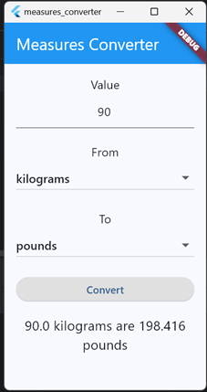

# measures_converter

Here's a comprehensive **README.md** for your `Measures_Converter` Flutter project, incorporating your assignment details, personal introduction, and technical information:

---

# 📏 Measures Converter (Flutter App)

A simple yet powerful unit conversion app built with Flutter, supporting length, weight, volume, and temperature conversions between metric and imperial units.


## ✨ Features

- Convert between **10+ units**:
  - **Length**: meters, feet, kilometers, miles
  - **Weight**: kilograms, pounds
  - **Volume**: liters, gallons
  - **Temperature**: Celsius, Fahrenheit
- Clean Material Design 3 UI
- Real-time calculation
- Input validation

---

## 🛠️ Technical Stack

- **Framework**: Flutter 3.x
- **Language**: Dart
- **Dependencies**:
  ```yaml
  flutter:
    sdk: flutter
  ```
- **Tools Used**:
  - Android Studio / VS Code
  - GitHub Copilot (AI pair programming)
  - Flutter SDK

---

## 🚀 How to Run

1. **Prerequisites**:

   - Flutter SDK ([Install guide](https://docs.flutter.dev/get-started/install))
   - Android/iOS emulator or physical device
2. **Steps**:

   ```sh
   git clone https://github.com/Diyar-coder-ui12/measures_converter.git
   cd measures_converter
   flutter pub get
   flutter run
   ```

---

## 📚 Assignment Details

**Course**: Software Engineering**Task**: Build a Flutter conversion app with:

- Dropdown unit selectors
- Real-time calculation
- Clean UI (per Material Design)

**Deliverables**:

- Dart source code (`main.dart`)
- GitHub repo link : [https://github.com/Diyar-coder-ui12/measures_converter ](https://github.com/Diyar-coder-ui12/measures_converter "github repo")
- Screenshot of output

---

## 🔗 Resources Used

- [Flutter Documentation](https://docs.flutter.dev/)
- [Dart Language Tour](https://dart.dev/guides/language/language-tour)
- [GitHub Copilot](https://github.com/features/copilot)

---

### Screenshots:

    
